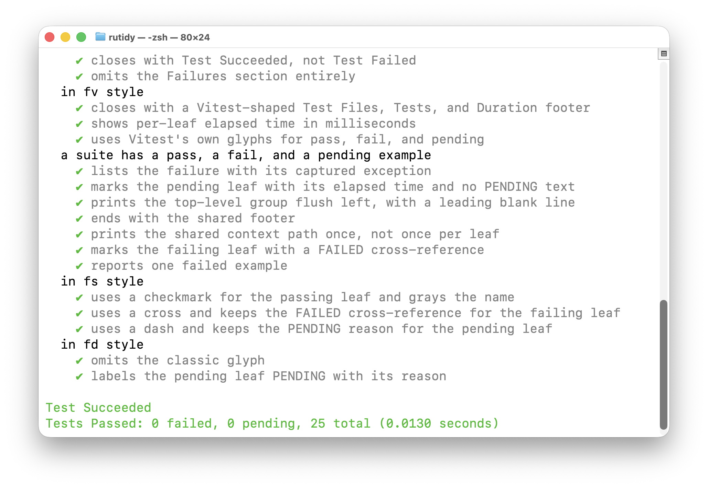

# rutidy

[](https://rubygems.org/gems/rutidy)
[](https://github.com/woodie/rutidy/actions/workflows/ci.yml)
[](https://github.com/woodie/rutidy/releases/latest)
[](LICENSE)



RSpec/Mocha/Vitest-style output for RSpec by hooking a real formatter into
the same tree the runner already builds. See at a glance which spec
actually failed, in whichever of the four familiar looks reads best for
your team, without giving up RSpec's own assertions or your existing suite.

## Installation

```
gem install rutidy
```

Or add it to your `Gemfile`:

```ruby
group :test do
  gem "rutidy"
end
```

## Usage

Run as a wrapper around `rspec`, passing any arguments through:

```
rutidy
rutidy spec/
rutidy -fd spec/calculator_spec.rb
```

Or read stdin, piping RSpec's own output through `rutidy`'s formatter first:

```
rspec --require rutidy/formatter --format Rutidy::Formatter | rutidy -fs
```

Or format an existing report file directly:

```
rutidy report.json
```

Flags select the output style -- see [Output styles](#output-styles) below.

### Version

```
rutidy --version
```

Prints the installed version and exits immediately, without waiting on
stdin or running `rspec`.

## Output styles

Four named styles, each matching a convention from a familiar test runner.
The first three end with the same shared footer; `-fv` ends with Vitest's
own footer shape instead.

| Flag | Convention | Look |
|---|---|---|
|   | Our base formatter | Glyph + `name (N seconds)`, failures add `(FAILED - N)` |
| -fd | RSpec's own doc format | Plain colored name, yellow `(PENDING: reason)` |
| -fs | Mocha's spec format | Green `✔` + gray name, red `✗ name (FAILED - N)` |
| -fv | Vitest's own tree | Green `✓ name`, two-toned green `2ms`, red `× name`, dim gray `↓ name` |

`-fv`'s `Test Files` line counts distinct `file_path`s across all examples --
exact, since every example already carries its own real spec file path.

## Things to know

### Why a real formatter, not a text post-processor

`gorderly`/`xctidy` parse `go test`/`xcodebuild`'s raw text output because
that's all those tools expose. RSpec is different: its own `--format json`
only reports a flattened `full_description` string (every `describe`/
`context`/`it` joined with plain spaces, no separator at all) with no
per-level boundaries -- reconstructing a real tree from that would mean
guessing where one group's text ends and the next begins, the exact
problem `xctidy` already has to solve for Quick/Nimble's comma-joined
names, except worse, since RSpec doesn't even delimit with commas.

`Rutidy::Formatter` sidesteps that entirely by hooking the same
`example_group_started`/`example_group_finished` notifications RSpec's own
`--format documentation` formatter uses internally -- the hierarchy comes
from the real stack the runner already maintains, not a guess.

### Limitations

- `Rutidy::Formatter` must run inside the same `rspec` process as your
  suite (via `--require`/`--format`, or `rutidy`'s own CLI wrapping
  `rspec` for you) -- it can't be retrofitted onto RSpec's own stock
  `--format json` output after the fact.
- Shared examples (`it_behaves_like`) show up as their own nesting level
  named after the shared group, matching what RSpec's own `--format
  documentation` already does -- not a `rutidy`-specific quirk.

## Development

```
make build    # gem build rutidy.gemspec
make install  # rake install
make test     # verbose, dogfoods rutidy on its own suite in -fd style
make lint     # standardrb
make check    # terse: silent on success, full log on failure
```
